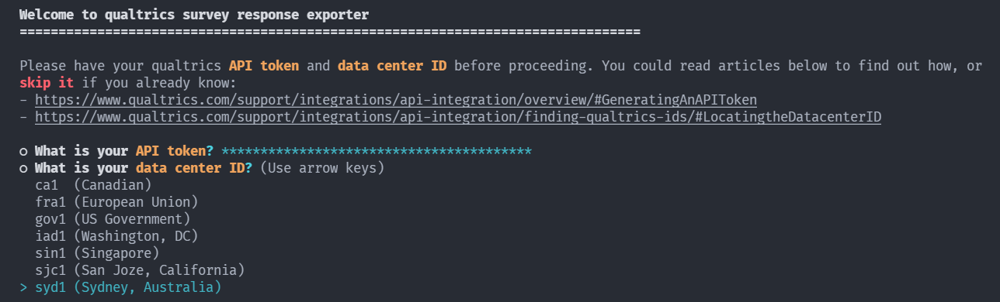
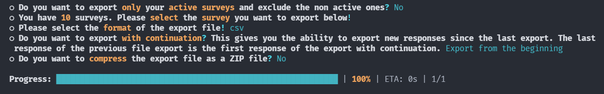

# Qualtrics Response Exporter
Simple tool to export survey responses automatically


## About The Project
If you have so many [Qualtrics](https://www.qualtrics.com) surveys and want to export its responses at once without having to click repeatedly on the web page, then this is the right tool for you. This app uses command line interface for user interaction as you can see below:







### Built With
* [TypeScript](https://www.typescriptlang.org/)
* [Inquirer.js](https://github.com/SBoudrias/Inquirer.js)
* [Axios HTTP Client](https://axios-http.com/)
* [Thread.js](https://threads.js.org/)
* [Limiter](https://github.com/jhurliman/node-rate-limiter)


## Getting Started
### Prerequisites
1. Your Qualtrics account must have access to the Qualtrics API feature. You need that access to generate an API token that will be used by this app.
2. You need to install [Node.js](https://nodejs.org/) runtime and [Git](https://git-scm.com/) on your machine.

### Installation
1. Open the terminal
2. Clone the repo
   ```sh
   git clone https://github.com/deddyss/qualtrics-response-exporter.git
   ```
3. Go to project directory
   ```sh
   cd qualtrics-response-exporter
   ```
4. Install NPM packages
   ```sh
   npm install
   ```
5. Build the app
   ```sh
   npm run build
   ```


## Usage
Use following command to start the app
```sh
npm run start
```


## License
Distributed under the MIT License. See `LICENSE` for more information.


## Acknowledgements
* [Jest](https://jestjs.io/)
* [Denque](https://github.com/invertase/denque)
* [Async-lock](https://github.com/rogierschouten/async-lock)
* [Fastify](https://www.fastify.io/)
* [CLI-Progress](https://github.com/npkgz/cli-progress)
* [Chalk](https://github.com/chalk/chalk)
* [Ora](https://github.com/sindresorhus/ora)
* [Get-port](https://github.com/sindresorhus/get-port)
* [App-root-path](https://github.com/inxilpro/node-app-root-path)
* [Pino](https://getpino.io/)
* [Webpack](https://webpack.js.org/)
* [Tsconfig-paths-webpack-plugin](https://github.com/dividab/tsconfig-paths-webpack-plugin)
* [Terser-webpack-plugin](https://github.com/webpack-contrib/terser-webpack-plugin)
* [Remove-files-webpack-plugin](https://github.com/Amaimersion/remove-files-webpack-plugin)
* [Simple-progress-webpack-plugin](https://github.com/dominique-mueller/simple-progress-webpack-plugin)
